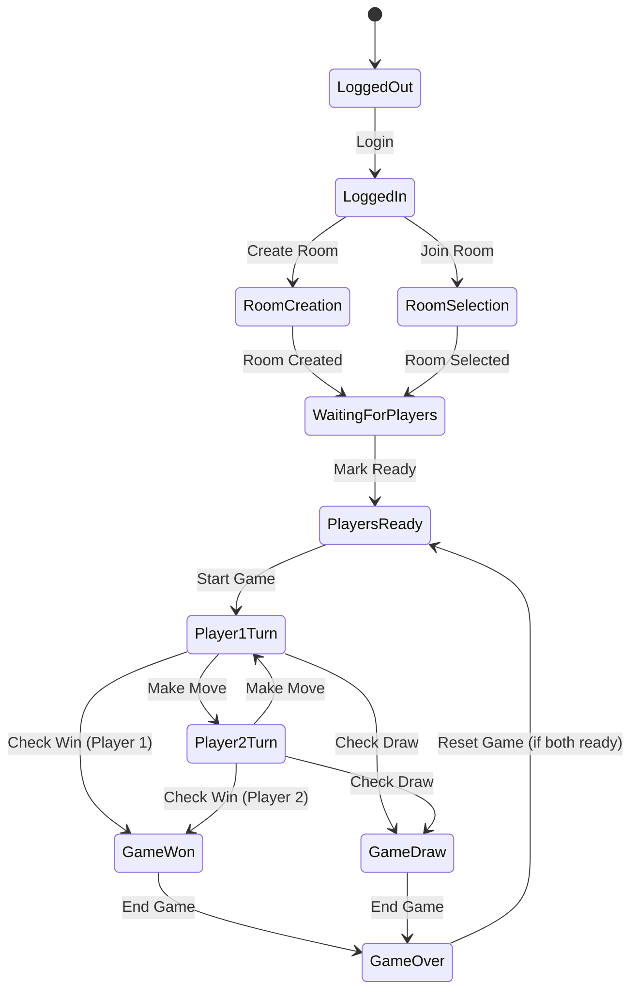

# Tic Tac Toe

## FSM

```mermaid
stateDiagram-v2
    [*] --> LoggedOut
    LoggedOut --> LoggedIn : Login
    LoggedIn --> RoomCreation : Create Room
    LoggedIn --> RoomSelection : Join Room
    RoomCreation --> WaitingForPlayers : Room Created
    RoomSelection --> WaitingForPlayers : Room Selected
    WaitingForPlayers --> PlayersReady : Mark Ready
    PlayersReady --> Player1Turn : Start Game
    Player1Turn --> Player2Turn : Make Move
    Player2Turn --> Player1Turn : Make Move
    Player1Turn --> GameWon : Check Win (Player 1)
    Player2Turn --> GameWon : Check Win (Player 2)
    Player1Turn --> GameDraw : Check Draw
    Player2Turn --> GameDraw : Check Draw
    GameWon --> GameOver : End Game
    GameDraw --> GameOver : End Game
    GameOver --> PlayersReady : Reset Game (if both ready)
```
